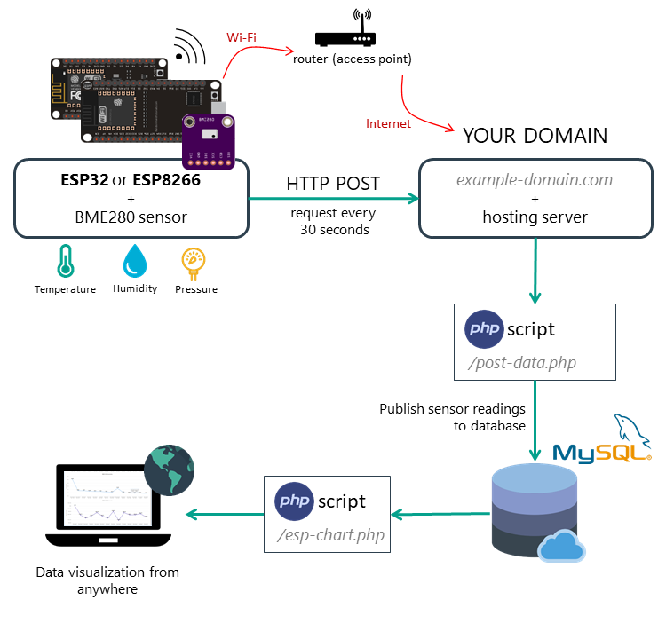

## Some Links

### Projects to show ESP32 sensor data on a web page

Skim these ideas to see what's involved and help decide if minimal or 'full-fat' solutin is needed.

*   [Minimal (serve data and HTML from ESP32)](https://circuits4you.com/2018/11/20/web-server-on-esp32-how-to-update-and-display-sensor-values/)
*   [Full-fat (project is PHP but can replace with Python)](https://randomnerdtutorials.com/esp32-esp8266-plot-chart-web-server/)

This image show the bits needed for a 'full-fat' solution (though I still recommend replacing PHP with Python)

<cite>Image copied from [here](https://randomnerdtutorials.com/visualize-esp32-esp8266-sensor-readings-from-anywhere/)</cite>